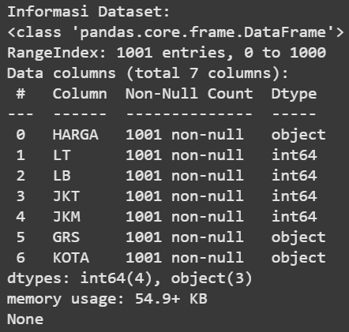
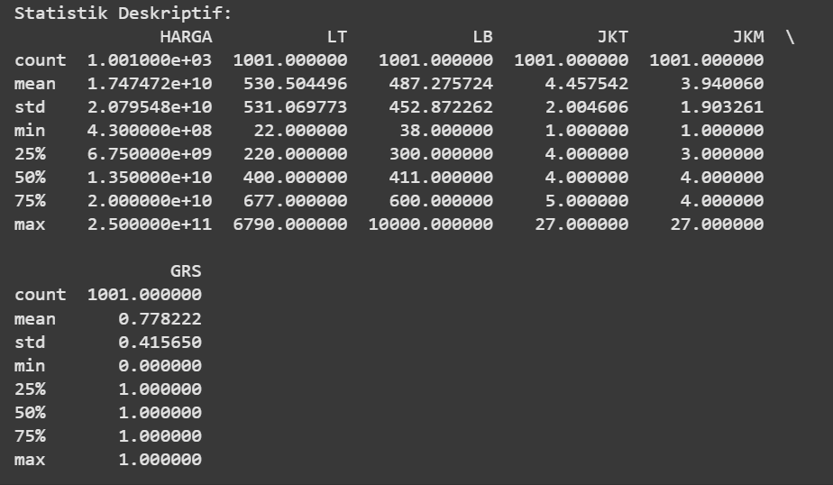
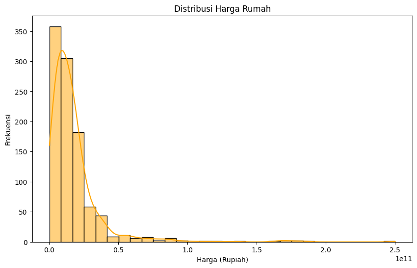
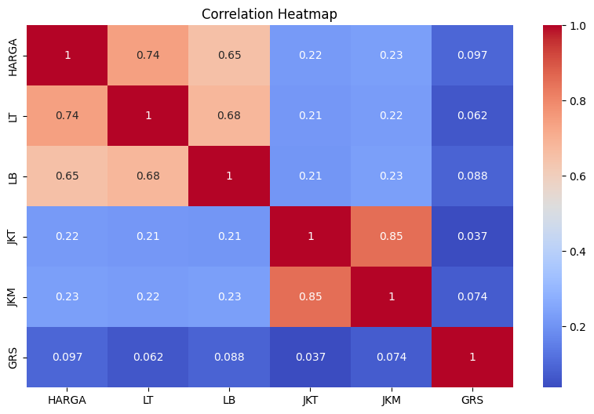
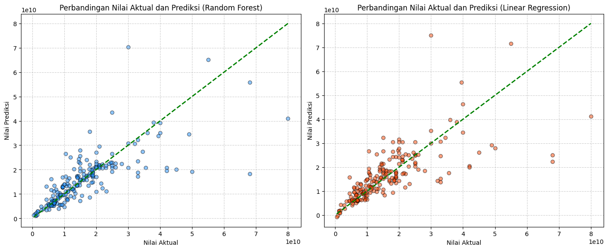

# Laporan Proyek Machine Learning - Briliona

## Domain Proyek - Ekonomi dan Bisnis atau Keuangan.

Properti merupakan salah satu sektor bisnis yang sangat berkembang, terutama di daerah perkotaan seperti Jakarta Selatan. Harga rumah di wilayah ini dapat dipengaruhi oleh berbagai faktor seperti luas tanah, luas bangunan, jumlah kamar tidur, jumlah kamar mandi, dan fasilitas tambahan seperti garasi. Dengan memanfaatkan Machine Learning, khususnya algoritma regresi, kita dapat membangun model prediktif yang dapat membantu dalam estimasi harga rumah berdasarkan fitur-fitur yang tersedia.

Menganalisis harga rumah secara akurat sangat penting bagi pembeli, penjual, maupun investor agar mereka dapat mengambil keputusan yang lebih tepat. Oleh karena itu, dalam proyek ini akan dilakukan prediksi harga rumah di Jakarta Selatan menggunakan algoritma Linear Regression dan Random Forest Regression.

Penelitian sebelumnya yang dilakukan oleh Nuzurilina menunjukkan bahwa metode regresi linear mampu memberikan estimasi harga rumah dengan akurasi yang cukup tinggi berdasarkan faktor-faktor utama yang mempengaruhi harga properti. Hasil penelitian ini menjadi salah satu acuan dalam mengembangkan model prediksi harga rumah dalam proyek ini.

**Referensi**:
- [Analisis Prediksi Harga Rumah Pada Machine Learning Metode Regresi Linear](https://journal.utmmataram.ac.id/index.php/explore/article/view/123)

## Business Understanding

### Problem Statements

Menjelaskan pernyataan masalah latar belakang:
- Bagaimana cara memprediksi harga rumah di Jakarta Selatan berdasarkan fitur-fitur seperti luas tanah, luas bangunan, jumlah kamar tidur, jumlah kamar mandi, dan keberadaan garasi?
- Algoritma Machine Learning mana yang memberikan hasil prediksi terbaik untuk harga rumah di Jakarta Selatan?

### Goals

Menjelaskan tujuan dari pernyataan masalah:
- Membangun model Machine Learning untuk memprediksi harga rumah di Jakarta Selatan berdasarkan dataset yang tersedia.
- Membandingkan performa antara algoritma Linear Regression dan Random Forest Regression untuk menentukan model terbaik.

### Solution statements
- Membangun model Machine Learning untuk memprediksi harga rumah di Jakarta Selatan berdasarkan dataset yang tersedia.
- Membandingkan performa antara algoritma Linear Regression dan Random Forest Regression untuk menentukan model terbaik.

--- 

## Data Understanding
Dataset yang digunakan dalam proyek ini merupakan dataset harga rumah di Jakarta Selatan yang diperoleh dari Kaggle. Dataset ini terdiri dari **7 fitur** dengan total **1000 data**. Dataset ini dapat diunduh dari [tautan Kaggle ini](https://www.kaggle.com/datasets/wageraldine/data-harga-rumah-jakarta-selatan-csv).

### Variabel dalam Dataset Harga Rumah Jakarta Selatan:

- **HARGA**: Harga rumah (Target variable)
- **LT**: Luas tanah
- **LB**: Luas bangunan
- **JKT**: Jumlah kamar tidur
- **JKM**: Jumlah kamar mandi
- **GRS**: Ada/tidak ada garasi
- **KOTA**: Nama kota yaitu dalam Projek ini Jaksel (Jakarta Selatan)

### Exploratory Data Analysis (EDA)

#### 1. Informasi Dataset
Berikut adalah Informasi Dataset:

Dari Informasi Dataset tersebut, Dataset berisi 1001 data dengan 7 fitur: HARGA (target, perlu dikonversi ke numerik), LT dan LB (luas tanah & bangunan), JKT dan JKM (jumlah kamar tidur & mandi), GRS (garasi, biner), serta KOTA (kategori). Rata-rata harga rumah Rp17,47 miliar dengan variasi besar (Rp430 juta - Rp250 miliar). Beberapa fitur memiliki outlier, seperti luas bangunan hingga 10.000 m² dan jumlah kamar 27. Evaluasi lebih lanjut diperlukan untuk menangani outlier serta normalisasi data sebelum digunakan dalam model Machine Learning.

#### 2. Distribusi Harga Rumah
Berikut adalah visualisasi distribusi harga rumah:

#### 3. Heatmap Korelasi Antar Fitur
Berikut adalah heatmap korelasi antar fitur:

---

## Data Preparation
1. **Handling Missing Values**: Tidak ada nilai yang hilang, sehingga tidak perlu imputasi data.
2. **Encoding Kolom Kategorikal**: Kolom `GRS` diubah menjadi biner (1 untuk ADA, 0 untuk TIDAK ADA) agar dapat diproses oleh model Machine Learning.
3. **Scaling Data**: Menggunakan `StandardScaler` untuk menyamakan skala fitur numerik sehingga algoritma berbasis gradien seperti Linear Regression dapat bekerja lebih optimal.
4. **Train-Test Split**: Data dibagi menjadi 80% untuk training dan 20% untuk testing guna mengevaluasi performa model pada data yang belum pernah dilihat sebelumnya.

---

## Modeling
Model yang digunakan dalam proyek ini adalah:
1. **Linear Regression**:  Model ini digunakan sebagai baseline untuk melihat hubungan linier antara variabel fitur dan harga rumah.
2. **Random Forest Regressor**: Model yang lebih kompleks untuk meningkatkan akurasi prediksi.

**Improvement**:
- ***Hyperparameter*** tuning pada **Random Forest Regressor** menggunakan `GridSearchCV` untuk menemukan parameter terbaik.

---

## Evaluation
Metrik evaluasi yang digunakan dalam proyek ini adalah:

- **Mean Absolute Error (MAE)**: Mengukur rata-rata selisih absolut antara prediksi dan nilai aktual.
- **Mean Squared Error (MSE)**: Mengukur rata-rata selisih kuadrat antara prediksi dan nilai aktual.
- **R-squared (R²)**: Menilai seberapa baik model menjelaskan variabilitas dalam data.

### Hasil Evaluasi Model:

| Model                    | MSE               | R²     |
| ------------------------ | ---------------- | ------ |
| Linear Regression        | 7.67 × 10¹⁹      | 0.4851 |
| Random Forest Regression | 6.51 × 10¹⁹      | 0.5627 |

Berikut adalah visualisasi hasil prediksi:

Berdasarkan hasil evaluasi, **Random Forest Regression memiliki performa lebih baik** dibandingkan dengan Linear Regression karena memiliki nilai MSE yang lebih rendah serta R² yang lebih tinggi.

## Kesimpulan

1. Model **Random Forest Regression** lebih unggul dalam memprediksi harga rumah di Jakarta Selatan dibandingkan **Linear Regression**.
2. Faktor utama yang mempengaruhi harga rumah adalah **luas tanah, luas bangunan, jumlah kamar tidur, dan jumlah kamar mandi**.
3. Model ini dapat digunakan sebagai alat bantu bagi pembeli dan investor dalam mengambil keputusan yang lebih tepat terkait properti di Jakarta Selatan.

**Catatan**:
- Gambar dapat ditemukan di folder `images`.