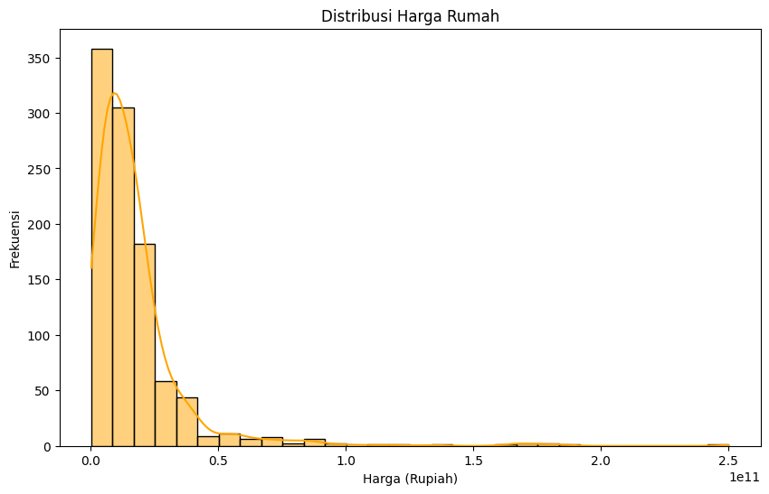

# Laporan Proyek Machine Learning - Briliona

## Domain Proyek - Ekonomi dan Bisnis atau Keuangan.

Properti merupakan salah satu sektor bisnis yang sangat berkembang, terutama di daerah perkotaan seperti Jakarta Selatan. Harga rumah di wilayah ini dapat dipengaruhi oleh berbagai faktor seperti luas tanah, luas bangunan, jumlah kamar tidur, jumlah kamar mandi, dan fasilitas tambahan seperti garasi. Dengan memanfaatkan Machine Learning, khususnya algoritma regresi, kita dapat membangun model prediktif yang dapat membantu dalam estimasi harga rumah berdasarkan fitur-fitur yang tersedia.

Menganalisis harga rumah secara akurat sangat penting bagi pembeli, penjual, maupun investor agar mereka dapat mengambil keputusan yang lebih tepat. Oleh karena itu, dalam proyek ini akan dilakukan prediksi harga rumah di Jakarta Selatan menggunakan algoritma Linear Regression dan Random Forest Regression.

Penelitian sebelumnya yang dilakukan oleh Nuzurilina menunjukkan bahwa metode regresi linear mampu memberikan estimasi harga rumah dengan akurasi yang cukup tinggi berdasarkan faktor-faktor utama yang mempengaruhi harga properti. Hasil penelitian ini menjadi salah satu acuan dalam mengembangkan model prediksi harga rumah dalam proyek ini.

**Referensi**:
- [Analisis Prediksi Harga Rumah Pada Machine Learning Metode Regresi Linear](https://journal.utmmataram.ac.id/index.php/explore/article/view/123)


## Business Understanding

### Problem Statements

Menjelaskan pernyataan masalah latar belakang:
- Bagaimana cara memprediksi harga rumah di Jakarta Selatan berdasarkan fitur-fitur seperti luas tanah, luas bangunan, jumlah kamar tidur, jumlah kamar mandi, dan keberadaan garasi?
- Algoritma Machine Learning mana yang memberikan hasil prediksi terbaik untuk harga rumah di Jakarta Selatan?

### Goals

Menjelaskan tujuan dari pernyataan masalah:
- Membangun model Machine Learning untuk memprediksi harga rumah di Jakarta Selatan berdasarkan dataset yang tersedia.
- Membandingkan performa antara algoritma Linear Regression dan Random Forest Regression untuk menentukan model terbaik.

### Solution statements
- Membangun model Machine Learning untuk memprediksi harga rumah di Jakarta Selatan berdasarkan dataset yang tersedia.
- Membandingkan performa antara algoritma Linear Regression dan Random Forest Regression untuk menentukan model terbaik.

--- 

## Data Understanding
Dataset yang digunakan dalam proyek ini merupakan dataset harga rumah di Jakarta Selatan yang diperoleh dari Kaggle. Dataset ini terdiri dari **7 fitur** dengan total **1000 data**. Dataset ini dapat diunduh dari [tautan Kaggle ini](https://www.kaggle.com/datasets/wageraldine/data-harga-rumah-jakarta-selatan-csv).

### Variabel dalam Dataset Harga Rumah Jakarta Selatan:

- **HARGA**: Harga rumah (Target variable)
- **LT**: Luas tanah
- **LB**: Luas bangunan
- **JKT**: Jumlah kamar tidur
- **JKM**: Jumlah kamar mandi
- **GRS**: Ada/tidak ada garasi
- **KOTA**: Nama kota yaitu dalam Projek ini Jaksel (Jakarta Selatan)

### Exploratory Data Analysis (EDA)

#### 1. Informasi Dataset
Berikut adalah Informasi Dataset:


Dari Informasi Dataset tersebut, Dataset berisi 1001 data dengan 7 fitur: HARGA (target, perlu dikonversi ke numerik), LT dan LB (luas tanah & bangunan), JKT dan JKM (jumlah kamar tidur & mandi), GRS (garasi, biner), serta KOTA (kategori). Rata-rata harga rumah Rp17,47 miliar dengan variasi besar (Rp430 juta - Rp250 miliar). Tidak ada missing values (semua kolom memiliki 1001 non-null entries). Kolom HARGA dan GRS bertipe object, yang kemungkinan perlu dikonversi ke tipe numerik untuk analisis lebih lanjut.

#### 2. Distribusi Harga Rumah
Berikut adalah visualisasi distribusi harga rumah:



#### 3. Heatmap Korelasi Antar Fitur
Berikut adalah heatmap korelasi antar fitur:


---

## Data Preparation
1. **Handling Missing Values**: Tidak ada nilai yang hilang, sehingga tidak perlu imputasi data.
2. **Menghapus Kolom yang Tidak Digunakan** : Menghapus Kolom `KOTA`
Karena semua rumah yang ada dalam dataset berlokasi di Jakarta Selatan, kolom `KOTA` tidak memberikan informasi yang signifikan dan dapat dihapus.
3. **Mengonversi Kolom Harga** : Mengonversi Kolom Harga dari Object menjadi int.
4. **Encoding Kolom Kategorikal**: Kolom `GRS` diubah menjadi biner (1 untuk ADA, 0 untuk TIDAK ADA) agar dapat diproses oleh model Machine Learning.
5. **Scaling Data**: Menggunakan `StandardScaler` untuk menyamakan skala fitur numerik sehingga algoritma berbasis gradien seperti Linear Regression dapat bekerja lebih optimal.
6. **Train-Test Split**: Data dibagi menjadi 80% untuk training dan 20% untuk testing guna mengevaluasi performa model pada data yang belum pernah dilihat sebelumnya.

---

## Modeling
## 1. Linear Regression

**Linear Regression** digunakan sebagai model baseline untuk menganalisis hubungan linier antara variabel fitur dan target yang diprediksi (misalnya, harga rumah). Model ini bekerja dengan mengasumsikan adanya hubungan linier antara input (fitur) dan output (target).

### Cara Kerja:
Model Linear Regression mencoba meminimalkan error antara prediksi dan nilai sebenarnya dengan menghitung koefisien untuk setiap fitur yang meminimalkan jumlah kuadrat selisih (MSE). Dengan demikian, model ini menghasilkan persamaan linier yang bisa digunakan untuk memprediksi harga rumah berdasarkan fitur-fitur yang ada.

### Parameter yang Digunakan:
- **fit_intercept**: Menentukan apakah model akan menyertakan intercept (nilai konstanta) dalam persamaan. Default: `True`.
- **normalize**: Menentukan apakah fitur akan dinormalisasi sebelum fit. Default: `False`.
- **copy_X**: Jika `True`, data input akan disalin untuk menjaga data asli tetap utuh. Default: `True`.
- **n_jobs**: Menentukan jumlah CPU yang digunakan untuk komputasi paralel. Default: `1` (menggunakan satu CPU).

### Kode Model Linear Regression:
```python
from sklearn.linear_model import LinearRegression
from sklearn.metrics import mean_squared_error, r2_score

# Membuat model Linear Regression
lr_model = LinearRegression()

# Melatih model menggunakan data latih
lr_model.fit(X_train, y_train)

# Melakukan prediksi pada data uji
y_pred_lr = lr_model.predict(X_test)

# Evaluasi model Linear Regression menggunakan MSE dan R-squared
mse_lr = mean_squared_error(y_test, y_pred_lr)
r2_lr = r2_score(y_test, y_pred_lr)

# Menampilkan hasil evaluasi
print(f"Linear Regression - MSE: {mse_lr}, R2: {r2_lr}")
```

### Evaluasi:
Setelah model dilatih, dilakukan evaluasi dengan menggunakan **Mean Squared Error (MSE)** dan **R-squared (R²)** untuk menilai seberapa baik model dalam memprediksi harga rumah berdasarkan data uji.

---

## 2. Random Forest Regressor

**Random Forest Regressor** adalah model ensemble yang menggunakan kumpulan pohon keputusan (decision trees) untuk meningkatkan akurasi prediksi. Model ini bekerja dengan cara membangun banyak pohon keputusan menggunakan subset acak dari data dan kemudian menggabungkan hasil prediksi dari setiap pohon untuk memberikan hasil yang lebih stabil dan akurat.

### Cara Kerja:
Random Forest bekerja dengan membangun banyak pohon keputusan dan menggabungkan hasilnya (voting untuk klasifikasi atau averaging untuk regresi). Masing-masing pohon keputusan dilatih pada subset data yang berbeda, dan setiap pohon hanya menggunakan subset fitur secara acak, sehingga mengurangi overfitting.

### Parameter yang Digunakan:
- **n_estimators**: Jumlah pohon keputusan yang akan dibuat dalam hutan. Default: `100`.
- **max_depth**: Kedalaman maksimum setiap pohon. Default: `None`, yang berarti pohon akan tumbuh hingga daun (leaf) tercapai.
- **min_samples_split**: Jumlah sampel minimum untuk membagi node internal. Default: `2`.
- **min_samples_leaf**: Jumlah sampel minimum di daun terminal. Default: `1`.
- **random_state**: Menentukan seed untuk pemrograman acak, yang menjamin konsistensi hasil setiap kali model dijalankan.

### Kode Model Random Forest Regressor:
```python
from sklearn.ensemble import RandomForestRegressor
from sklearn.metrics import mean_squared_error, r2_score

# Membuat model Random Forest Regressor
rf_model = RandomForestRegressor(n_estimators=100, random_state=42)

# Melatih model menggunakan data latih
rf_model.fit(X_train, y_train)

# Melakukan prediksi pada data uji
y_pred_rf = rf_model.predict(X_test)

# Evaluasi model Random Forest Regressor menggunakan MSE dan R-squared
mse_rf = mean_squared_error(y_test, y_pred_rf)
r2_rf = r2_score(y_test, y_pred_rf)

# Menampilkan hasil evaluasi
print(f"Random Forest Regressor - MSE: {mse_rf}, R2: {r2_rf}")
```

### Evaluasi:
Setelah model Random Forest dilatih, dilakukan evaluasi dengan menggunakan **Mean Squared Error (MSE)** dan **R-squared (R²)** untuk menilai seberapa baik model dapat memprediksi harga rumah berdasarkan data uji.

---

## Evaluation
Metrik evaluasi yang digunakan dalam proyek ini adalah:

- **Mean Absolute Error (MAE)**: Mengukur rata-rata selisih absolut antara prediksi dan nilai aktual.
- **Mean Squared Error (MSE)**: Mengukur rata-rata selisih kuadrat antara prediksi dan nilai aktual.
- **R-squared (R²)**: Menilai seberapa baik model menjelaskan variabilitas dalam data.

### Hasil Evaluasi Model:

| Model                    | MSE               | R²     |
| ------------------------ | ---------------- | ------ |
| Linear Regression        | 7.67 × 10¹⁹      | 0.4851 |
| Random Forest Regression | 6.51 × 10¹⁹      | 0.5627 |

Berikut adalah visualisasi hasil prediksi:


Berdasarkan hasil evaluasi, **Random Forest Regression memiliki performa lebih baik** dibandingkan dengan Linear Regression karena memiliki nilai MSE yang lebih rendah serta R² yang lebih tinggi.

### Prediksi dengan Model yang Disimpan

```python
loaded_model = joblib.load('prediksi_harga_rumah_jaksel_rf.pkl')
loaded_scaler = joblib.load('scaler.pkl')
new_data = np.array([[600, 350, 5, 4, 1]])
new_data_scaled = loaded_scaler.transform(new_data)
predicted_price = loaded_model.predict(new_data_scaled)
print(f"Prediksi Harga Rumah: Rp {predicted_price[0]:,.2f}")
```
output : 

---
## Kesimpulan

1. Model **Random Forest Regression** lebih unggul dalam memprediksi harga rumah di Jakarta Selatan dibandingkan **Linear Regression**.
2. Faktor utama yang mempengaruhi harga rumah adalah **luas tanah, luas bangunan, jumlah kamar tidur, dan jumlah kamar mandi**.
3. Model ini dapat digunakan sebagai alat bantu bagi pembeli dan investor dalam mengambil keputusan yang lebih tepat terkait properti di Jakarta Selatan.

**Catatan**:
- Gambar dapat ditemukan di folder `image`.